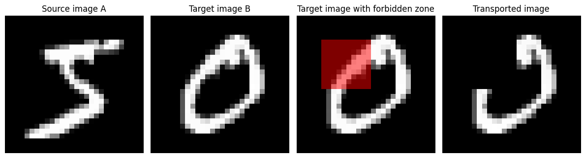

# Sinkhorn-type Algorithm for Constrained Optimal Transport

This repository contains a JAX-based implementation and notebook demonstrating the **Sinkhorn-type algorithm for constrained optimal transport**, as proposed in the paper:

> **A Sinkhorn-type Algorithm for Constrained Optimal Transport**  
> *Xun Tang, Holakou Rahmanian, Michael Shavlovsky, Kiran Koshy Thekumparampil, Tesi Xiao, Lexing Ying*  
> [paper]([https://arxiv.org/abs/2310.11516](https://openreview.net/pdf?id=V5kCKFav9j))

## 📌 Project Goals

The objective of this notebook is to:

- Implement the constrained Sinkhorn algorithm introduced in the paper
- Demonstrate its effectiveness on synthetic examples
- Monitor both transport cost and constraint violations
- Lay the groundwork for integration into libraries such as [OTT-JAX](https://github.com/ott-jax/ott)

## 🧠 Method Summary

The method extends the classical entropic OT formulation by introducing linear constraints on the coupling matrix. These constraints are enforced through dual variables updated at each iteration, leading to a projected Sinkhorn scheme.

Key features:

- Support for equality constraints \( C(P) = b \)
- Dual update steps integrated with Sinkhorn iterations
- Compatibility with JAX for GPU/TPU acceleration

## 🧪 Notebook Contents

The notebook `Sinkhorn_constrained.ipynb` includes:

- Implementation of the algorithm
- Reproduction of the constraint matrix \( D \) generation as in Equation (13) of the paper
- Visualization of the convergence behavior
- Application to the MNIST dataset (e.g., constrained transport between digit distributions)

  

## 🚀 Installation

You will need:

- Python ≥ 3.9
- [JAX](https://github.com/google/jax)
